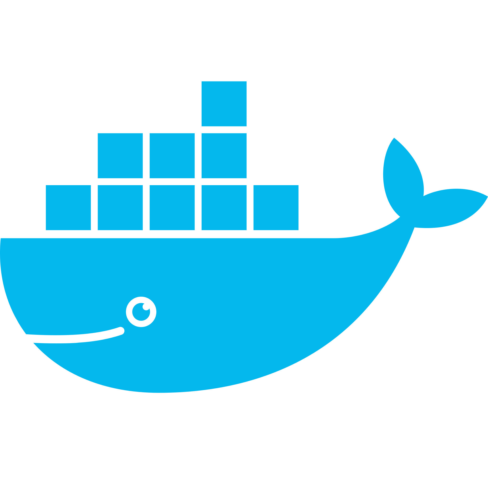

# Deploy with Docker

The prerequisite to run and deploy ATON + THOTH using Docker is to have [Docker](https://www.docker.com/) installed, and to have downloaded/cloned the [THOTH](https://github.com/TEXTaiLES/thoth) repository locally.

<p align="center">
    <a href = "https://pm2.keymetrics.io/" target="_blank">
        
    </a>
</p>


### Quick run

The super-quick way to deploy THOTH framework using Docker in a single command is:

```
docker compose up --build
```

This will build, run and deploy ATON framework with THOTH integrated as a web-app on local port 8088 using a basic configuration, after a fresh install of the framework (e.g. after first clone from github). Note that this does not require downloading or deploying ATON first, as this is handled by the Dockerfile.

## Build a Docker image of THOTH

This step allows you to build a docker image which contains ATON + THOTH using the Dockerfile inside the main THOTH folder:

```
sudo docker build -t thoth
```

This process creates a docker image named **thoth**. This will automatically create the image starting from the current location, install ATON and the relevant dependencies and paste the THOTH web app in the appropriate folder.

## Basic deploy 

Once we built our docker image, we can create and run a new container from **thoth** image by typing:

```
sudo docker run --rm thoth -dp 8080:8080 thoth
```

This will create a container using the image thoth and expose ATON's service in port **8080**. Notice that when the container will be stopped, all changes will be lost (e.g. new scenes, new users, etc…), since by default all files created inside a container are stored on a writable container layer. 

*Note that you can modify the Dockerfile according to the needs of your project/service. For instructions on that refer to the respective [ATON documentation on Docker deployment](https://osiris.itabc.cnr.it/aton/index.php/tutorials/getting-started/run-deploy-with-docker/)*