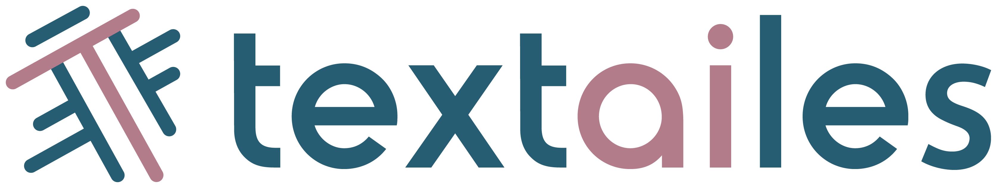

# THOTH documentation

    

THOTH is a browser-based 3D viewer and annotator developed as part of the [TEXTaiLES](https://www.echoes-eccch.eu/textailes/) toolbox. It is built on the [ATON Framework](https://osiris.itabc.cnr.it/aton/) and supports structured, model-scoped annotations for cultural-heritage assets.

With THOTH you can:

- load one or more 3D models into a scene;
- select mesh faces with brush, eraser, and lasso tools;
- add point-based semantic annotations;
- measure Euclidean, approximate geodesic, and exact surface distances;
- attach descriptions and related RGB, multispectral, and artefact records to annotations;
- edit schema-driven model metadata;
- collaborate on a scene in real time; and
- save to the configured backend or download canonical JSON.

## Choose a starting point

- New users: [open a scene](scene/open_scene.md), then read the [user interface](manual/ui.md) and [tools](manual/tools.md) guides.
- Administrators: choose [native ATON](deployment/installation_basic.md), [Docker](deployment/docker.md), or [HESTIA-integrated Docker](deployment/hestia.md).
- Integrators: start with the [scene JSON](scene/scene_structure.md), [HTTP API](api/rest.md), and [internal event API](api/events.md) references.

THOTH runs in two backend modes. **Local mode** uses ATON's scene, model, and username/password services. **HESTIA mode** uses THOTH's authenticated same-origin gateway to access HESTIA resources and provides EGI and HESTIA Portal sign-in flows. Features that depend on HESTIA data, such as remote image and sensor relations, return empty data in local mode unless equivalent endpoints are configured.

    

